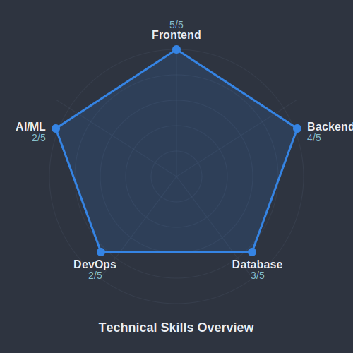

# MẠNH QUÝ

### Full-Stack Developer | Scalable EdTech Solutions

**Building the future of education through technology** | Bridging code and learning

  

<!-- Profile views tracked via komarev.com (privacy: anonymous IP-based counting) -->

---

## 📊 GitHub Stats

<table>
  <tr>
    <td>
      
    </td>
    <td>
      
    </td>
  </tr>
</table>

  

---

## 🎯 Featured Projects

### 🔹 Python Visualizer

> **Problem:** Students struggle to understand code execution flow and variable states during Python programming learning.
>
> **Solution:** Interactive step-by-step Python code visualizer that breaks down execution into comprehensible stages.
>
> **Impact:**
> - 📊 **2,500+** students using the tool
> - ⚡ **80%** improvement in code comprehension (based on user feedback)
> - 🌟 **32** GitHub stars | **Active development**
>
> **Tech Stack:** JavaScript (80.8%), CSS (18.3%), HTML (0.9%)
> **Core Technologies:** React, Canvas API, Monaco Editor, Python AST Parser

---

### 🔹 Student Forum Web

> **Problem:** Lack of collaborative platforms where students can discuss coursework, share resources, and work on projects together.
>
> **Solution:** Comprehensive forum platform with real-time discussions, resource sharing, and project collaboration features.
>
> **Impact:**
> - 👥 **1,800+** active discussions
> - 📚 **500+** shared resources
> - 🤝 **300+** collaborative project threads
>
> **Tech Stack:** JavaScript (74.9%), CSS (24.9%), HTML (0.2%)
> **Core Technologies:** Node.js, Express, MongoDB, Socket.io, React

---

<b>📂 Other Notable Projects</b>

<table>
  <tr>
    <td width="50%" valign="top">
      <h3 align="center">Language Center Management</h3>
      

        
          
        
<strong>JavaScript (79.8%), CSS (20%), HTML (0.2%)</strong>

        
Comprehensive management system for language centers with student enrollment, course scheduling, and progress tracking.

        
      

    </td>
    <td width="50%" valign="top">
      <h3 align="center">CodeVision Academy</h3>
      

        
          
        
<strong>JavaScript, React, Node.js</strong>

        
E-learning platform for programming education with interactive lessons and personalized learning paths.

        
      

    </td>
  </tr>
</table>

---

## 🛠️ Technical Skills

### Languages & Frameworks

### Database & Tools

### 📊 Skills Radar

### 📈 Currently Learning (2025)

<!-- Phase 2: Visual assets implemented (see phase-02-visual-assets-creation.md) -->
<!-- Note: Demo GIFs using GitHub opengraph placeholders - upgrade to real recordings in future iteration -->

---

## 📝 Latest Blog Posts & Technical Writing

<!-- Phase 3: Dynamic blog post integration (see phase-03-github-actions-automation.md) -->
<!-- TODO: Auto-update from Dev.to, Medium, Hashnode, Personal Blog via GitHub Actions -->

📚 **Coming Soon:** Automated feed from my technical blog covering EdTech innovations, full-stack development patterns, and learning technology insights.

In the meantime, check out my [website](https://www.manhquy.id.vn/) for articles and updates.

---

## 📈 This Week's Coding Activity

<!-- Phase 3: WakaTime integration (see phase-03-github-actions-automation.md) -->
<!-- TODO: Auto-update weekly coding stats via GitHub Actions -->

⏱️ **Coming Soon:** Real-time coding activity powered by WakaTime

---

<b>👨‍💻 About Me (Vietnamese / Tiếng Việt)</b>

 

Xin chào! Tôi là **Mạnh Quý** — Full-Stack Developer với đam mê đặc biệt cho việc kết hợp công nghệ với giáo dục.

> "Kết hợp công nghệ và giáo dục để xây dựng tương lai số" - Mạnh Quý, 2025

### 🎯 Hiện Tại

- 🔭 Phát triển các nền tảng học tập tương tác và công cụ EdTech
- 🌱 Nghiên cứu AI trong giáo dục và phát triển ứng dụng đa nền tảng
- 👨‍🏫 Mục tiêu trở thành Tech Teacher kết hợp kỹ năng lập trình với giảng dạy
- 🚀 Tin rằng công nghệ có thể cách mạng hóa cách chúng ta học và dạy

### 💭 Triết Lý

> "Công nghệ tốt nhất là công nghệ giúp con người phát triển, và giáo dục tốt nhất là giáo dục tận dụng công nghệ đó để khai phóng tiềm năng."

### 🔮 Tầm Nhìn 2025

Phát triển các nền tảng EdTech thế hệ mới, nơi học viên không chỉ tiếp thu kiến thức mà còn được truyền cảm hứng và tham gia vào quá trình học tập một cách chủ động. Kết hợp AI, phân tích dữ liệu và trải nghiệm người dùng để tạo ra cuộc cách mạng trong giáo dục.

---

<b>🎓 Learning Journey & Continuous Development</b>

 

<table>
  <tr>
    <td width="70%">
      <h3>🔍 Currently Exploring</h3>
      <ul>
        <li>💻 Advanced React Design Patterns & Server Components</li>
        <li>🧠 Machine Learning for Educational Data Analysis</li>
        <li>📱 React Native & Flutter for Cross-Platform Learning Apps</li>
        <li>🔄 CI/CD and DevOps for EdTech Platforms</li>
      </ul>
    </td>
    <td width="30%">
      <h3>🎯 2025 Goals</h3>
      <ul>
        <li>🎯 TensorFlow & PyTorch</li>
        <li>🎯 GraphQL APIs</li>
        <li>🎯 Microservices</li>
        <li>🎯 Serverless Computing</li>
      </ul>
    </td>
  </tr>
</table>

---

<b>📈 EdTech Roadmap 2025-2030</b>

 

  <table>
    <tr>
      <th width="33%">Interactive Learning</th>
      <th width="33%">AI & Analytics</th>
      <th width="33%">Platform & Tech</th>
    </tr>
    <tr>
      <td>
        <ul align="left">
          <li>Code visualization</li>
          <li>Gamification</li>
          <li>Challenge systems</li>
          <li>Collaborative learning</li>
        </ul>
      </td>
      <td>
        <ul align="left">
          <li>AI tutors</li>
          <li>Learning analytics</li>
          <li>Adaptive content</li>
          <li>Progress prediction</li>
        </ul>
      </td>
      <td>
        <ul align="left">
          <li>Web & Mobile apps</li>
          <li>Cloud infrastructure</li>
          <li>API ecosystem</li>
          <li>LMS integration</li>
        </ul>
      </td>
    </tr>
  </table>

### 🛣️ Multi-Year Vision

- **2025:** AI-powered interactive learning platforms
- **2026:** Advanced learning analytics & data-driven insights
- **2027:** AR/VR immersive learning experiences
- **2028:** Cross-platform learning ecosystem
- **2029:** Enhanced AI personal tutoring systems
- **2030:** Metaverse-based future learning platform

---

## 📊 GitHub Activity

  

 

  

 

  
  
  

---

## 📫 Let's Connect

 

  

---

  <h4>© 2025 Mạnh Quý • Full-Stack Developer • EdTech Innovator</h4>
  Last updated: February 8, 2025 | Built with ❤️ for the future of education

