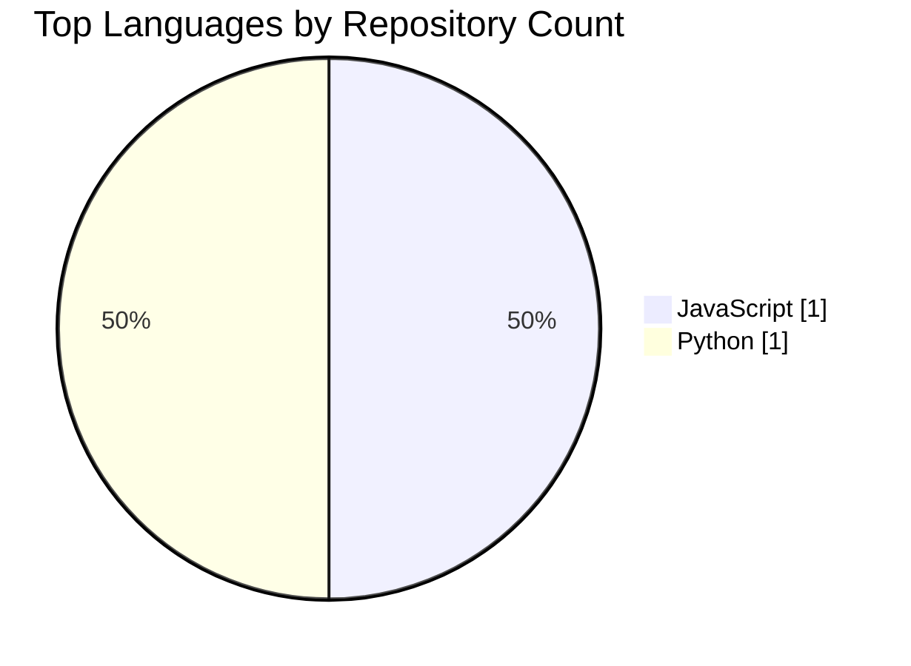
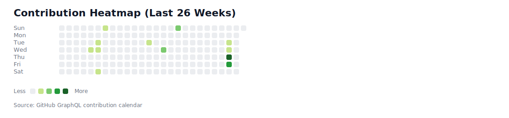
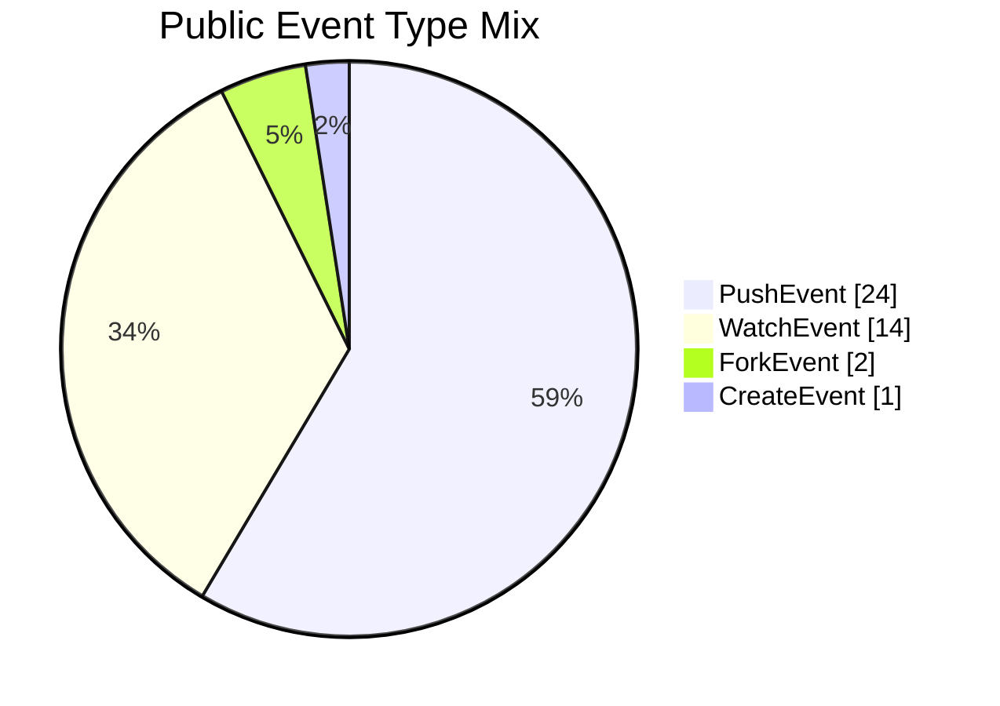

<!-- Typing Animation -->
<p align="center">
  
</p>

<!-- Shield Stats Badges -->
<p align="center">
  <a href="https://github.com/manhquydev">
    
  </a>
  <a href="https://github.com/manhquydev">
    
  </a>
  
</p>

<!-- HERO-KPI:START -->
<table>
  <tr>
    <td align="center"><strong>Followers</strong><br/>2</td>
    <td align="center"><strong>Public Repos</strong><br/>11</td>
    <td align="center"><strong>Contributions (30d)</strong><br/>36</td>
    <td align="center"><strong>Contributions (12m)</strong><br/>76</td>
  </tr>
</table>

<sub>Last updated: 2026-04-19 05:27:17 UTC</sub>
<!-- HERO-KPI:END -->

---

<!-- Tech Stack -->
### 🛠️ Tech Stack

<p align="center">
  
  
  
  
  
</p>

<p align="center">
  
  
  
  
</p>

<sub align="center"><em>Clean architecture, reliable backend, maintainable frontend</em></sub>

---

<!-- GitHub Analytics -->
## 📊 GitHub Analytics

<!-- GITHUB-ANALYTICS:START -->
<table>
  <tr><td><strong>Profile</strong></td><td><a href="https://github.com/manhquydev">manhquydev</a></td></tr>
  <tr><td><strong>Following</strong></td><td>2</td></tr>
  <tr><td><strong>Public Gists</strong></td><td>0</td></tr>
  <tr><td><strong>Total Stars (owned repos)</strong></td><td>0</td></tr>
  <tr><td><strong>Total Forks (owned repos)</strong></td><td>0</td></tr>
  <tr><td><strong>Account Created</strong></td><td>2022-11-11</td></tr>
</table>

**Top Languages (by repository count)**

`JavaScript: 1` `Python: 1`


```mermaid
pie showData
  title Top Languages by Repository Count
  "JavaScript" : 1
  "Python" : 1
```

<sub>Source: GitHub REST API.</sub>
<!-- GITHUB-ANALYTICS:END -->

---

<!-- Contribution Details - Expanded -->
<details open>
<summary>📈 Contribution Details</summary>

<!-- CONTRIBUTION-GRAPH:START -->
<div align="center">
  <picture>
    <source media="(prefers-color-scheme: dark)" srcset="./assets/readme/contribution-heatmap-dark.svg">
    <source media="(prefers-color-scheme: light)" srcset="./assets/readme/contribution-heatmap-light.svg">
    
  </picture>
</div>

<sub>Intensity scale reflects GitHub contribution levels from low to high.</sub>
<!-- CONTRIBUTION-GRAPH:END -->

<!-- CONTRIBUTION-ACTIVITY:START -->
**Contributions (12m):** 76  
**Contributions (30d):** 36

`............#-........::......`

<sub>Trend line for recent days (`.` low -> `#` high).</sub>

<details>
<summary>Daily breakdown (last 14 days)</summary>

| Date | Contributions |
|---|---:|
| 2026-04-06 | 0 |
| 2026-04-07 | 0 |
| 2026-04-08 | 0 |
| 2026-04-09 | 0 |
| 2026-04-10 | 0 |
| 2026-04-11 | 0 |
| 2026-04-12 | 4 |
| 2026-04-13 | 4 |
| 2026-04-14 | 0 |
| 2026-04-15 | 0 |
| 2026-04-16 | 0 |
| 2026-04-17 | 0 |
| 2026-04-18 | 0 |
| 2026-04-19 | 0 |

</details>

**Top Event Types (latest public events)**

| Event Type | Count |
|---|---:|
| PushEvent | 24 |
| WatchEvent | 14 |
| ForkEvent | 2 |
| CreateEvent | 1 |


```mermaid
pie showData
  title Public Event Type Mix
  "PushEvent" : 24
  "WatchEvent" : 14
  "ForkEvent" : 2
  "CreateEvent" : 1
```

<sub>Source: GitHub GraphQL + GitHub REST API.</sub>
<!-- CONTRIBUTION-ACTIVITY:END -->

### 📈 Activity Graph

<p align="center">
  <a href="https://github.com/ashutosh00710/github-readme-activity-graph">
    
  </a>
</p>

</details>

---

<!-- Project Stats -->
## 📁 Project Statistics

<!-- PROJECT-STATS:START -->
<table>
  <tr>
    <td>
      <strong><a href="https://github.com/manhquydev/manhquydev">manhquydev</a></strong><br/>
      JavaScript | Stars 0 | Forks 0 | Watchers 0 | Updated 2026-04-18
    </td>
  </tr>
  <tr>
    <td>
      <strong><a href="https://github.com/manhquydev/Flappy-Bird">Flappy-Bird</a></strong><br/>
      Python | Stars 0 | Forks 0 | Watchers 0 | Updated 2026-04-13
    </td>
  </tr>
</table>

<sub>Source: GitHub REST API.</sub>
<!-- PROJECT-STATS:END -->

---

<!-- Social -->
## 📫 Connect With Me

<p align="center">
  <a href="https://github.com/manhquydev">
    
  </a>
  <a href="https://linkedin.com/in/manhquy">
    
  </a>
  <a href="mailto:manhquydev@gmail.com">
    
  </a>
  <a href="https://www.manhquy.id.vn/">
    
  </a>
</p>

<!-- Current Focus -->
## 🎯 Current Focus

```
🎓 Domain      EdTech & Learning Systems
🔭 Focus       Clean Architecture & CI/CD
💬 Ask me about React, Node.js, MongoDB
⚡ Fun fact    I automate everything possible
```

<!-- Quote -->
### 💡 Random Dev Quote

<p align="center">
  
</p>

---

<!-- Wave Footer -->
<p align="center">
  
</p>

<sub>⚡ Contribution graph & stats auto-generated with GitHub Actions daily</sub>
