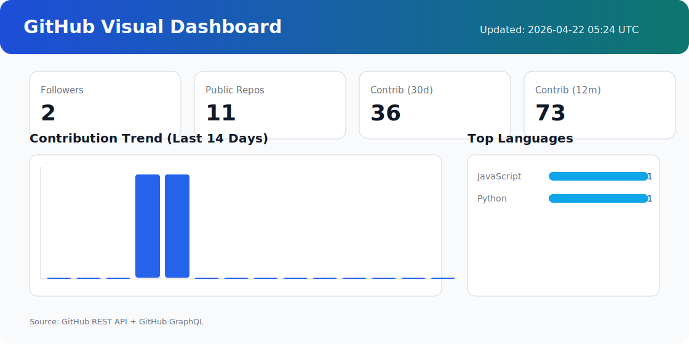
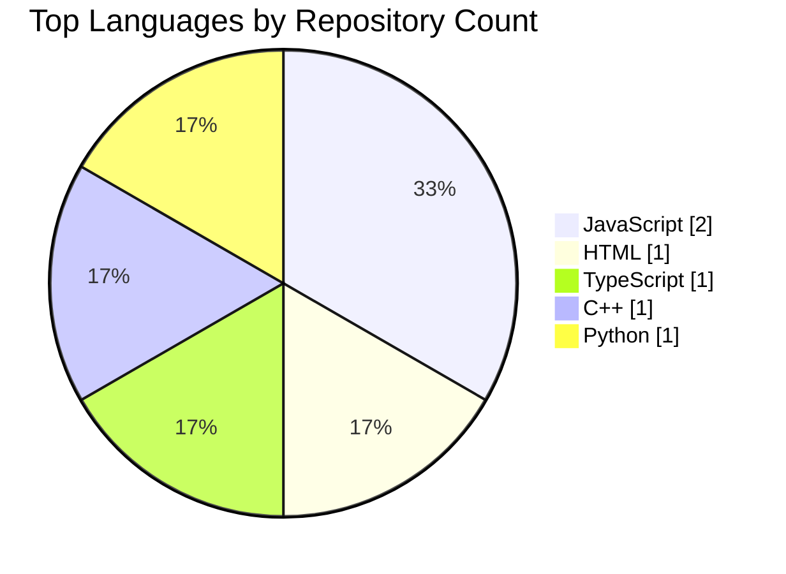
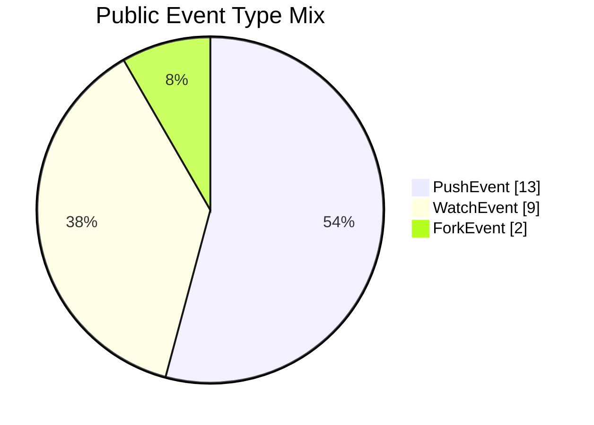

<div align="center">
  <h1>Manh Quy</h1>
  <p>Full-Stack Developer focused on EdTech systems</p>
  <p>
    <a href="https://www.manhquy.id.vn/">Website</a> |
    <a href="https://linkedin.com/in/manhquy">LinkedIn</a> |
    <a href="mailto:manhquydev@gmail.com">Email</a> |
    <a href="https://github.com/manhquydev">GitHub</a>
  </p>
</div>

---

## Professional Summary

I build practical full-stack systems for education workflows and team collaboration.
My focus is clean architecture, reliable backend services, and maintainable frontend delivery.

## Core Stack

`JavaScript` `TypeScript` `React` `Node.js` `Express` `MongoDB` `PostgreSQL` `Docker` `GitHub Actions`

## Work Focus Snapshot

<table>
  <tr>
    <td valign="top" width="50%">
      <strong>Domain Focus</strong><br/>
      EdTech platforms<br/>
      Learning workflows<br/>
      Collaboration systems
    </td>
    <td valign="top" width="50%">
      <strong>Delivery Focus</strong><br/>
      System architecture<br/>
      Backend API design<br/>
      Frontend implementation<br/>
      CI/CD automation
    </td>
  </tr>
</table>

---

## GitHub Data (Real, GitHub API Only)

<div align="center">
  <picture>
    <source media="(prefers-color-scheme: dark)" srcset="./assets/readme/github-dashboard-dark.svg">
    <source media="(prefers-color-scheme: light)" srcset="./assets/readme/github-dashboard-light.svg">
    
  </picture>
</div>

<sub>Visual dashboard is auto-generated from GitHub REST/GraphQL data.</sub>

<!-- HERO-KPI:START -->
<table>
  <tr>
    <td align="center"><strong>Followers</strong><br/>2</td>
    <td align="center"><strong>Public Repos</strong><br/>18</td>
    <td align="center"><strong>Contributions (30d)</strong><br/>15</td>
    <td align="center"><strong>Contributions (12m)</strong><br/>79</td>
  </tr>
</table>

<sub>Last updated: 2026-04-02 11:13:51 UTC</sub>
<!-- HERO-KPI:END -->

<details open>
<summary><strong>GitHub Analytics</strong></summary>

<!-- GITHUB-ANALYTICS:START -->
<table>
  <tr><td><strong>Profile</strong></td><td><a href="https://github.com/manhquydev">manhquydev</a></td></tr>
  <tr><td><strong>Following</strong></td><td>2</td></tr>
  <tr><td><strong>Public Gists</strong></td><td>0</td></tr>
  <tr><td><strong>Total Stars (owned repos)</strong></td><td>0</td></tr>
  <tr><td><strong>Total Forks (owned repos)</strong></td><td>0</td></tr>
  <tr><td><strong>Account Created</strong></td><td>2022-11-11</td></tr>
</table>

**Top Languages (by repository count)**

`JavaScript: 2` `HTML: 1` `TypeScript: 1` `C++: 1` `Python: 1`


```mermaid
pie showData
  title Top Languages by Repository Count
  "JavaScript" : 2
  "HTML" : 1
  "TypeScript" : 1
  "C++" : 1
  "Python" : 1
```

<sub>Source: GitHub REST API.</sub>
<!-- GITHUB-ANALYTICS:END -->

</details>

<details open>
<summary><strong>Contribution Graph</strong></summary>

<!-- CONTRIBUTION-GRAPH:START -->
```text
Sun  ........=.......
Mon  ................
Tue  ................
Wed  ....-.=........-
Thu  ...............@
Fri  ................
Sat  .=..............
```

Legend: `.` none, `-` low, `=` medium, `#` high, `@` very high

<sub>Source: GitHub GraphQL contribution calendar (last 16 weeks).</sub>
<!-- CONTRIBUTION-GRAPH:END -->

</details>

<details open>
<summary><strong>Contribution Activity</strong></summary>

<!-- CONTRIBUTION-ACTIVITY:START -->
**Contributions (12m):** 79  
**Contributions (30d):** 15

`............................:#`

<sub>Trend line for recent days (`.` low -> `#` high).</sub>

<details>
<summary>Daily breakdown (last 14 days)</summary>

| Date | Contributions |
|---|---:|
| 2026-03-20 | 0 |
| 2026-03-21 | 0 |
| 2026-03-22 | 0 |
| 2026-03-23 | 0 |
| 2026-03-24 | 0 |
| 2026-03-25 | 0 |
| 2026-03-26 | 0 |
| 2026-03-27 | 0 |
| 2026-03-28 | 0 |
| 2026-03-29 | 0 |
| 2026-03-30 | 0 |
| 2026-03-31 | 0 |
| 2026-04-01 | 2 |
| 2026-04-02 | 13 |

</details>

**Top Event Types (latest public events)**

| Event Type | Count |
|---|---:|
| PushEvent | 13 |
| WatchEvent | 9 |
| ForkEvent | 2 |


```mermaid
pie showData
  title Public Event Type Mix
  "PushEvent" : 13
  "WatchEvent" : 9
  "ForkEvent" : 2
```

<sub>Source: GitHub GraphQL + GitHub REST API.</sub>
<!-- CONTRIBUTION-ACTIVITY:END -->

</details>

<details open>
<summary><strong>Public Repository Snapshot</strong></summary>

<!-- PROJECT-STATS:START -->
<table>
  <tr>
    <td>
      <strong><a href="https://github.com/manhquydev/manhquydev">manhquydev</a></strong><br/>
      JavaScript | Stars 0 | Forks 0 | Watchers 0 | Updated 2026-04-02
    </td>
  </tr>
  <tr>
    <td>
      <strong><a href="https://github.com/manhquydev/rice-cooker-order-system">rice-cooker-order-system</a></strong><br/>
      HTML | Stars 0 | Forks 0 | Watchers 0 | Updated 2025-12-27
    </td>
  </tr>
  <tr>
    <td>
      <strong><a href="https://github.com/manhquydev/AI-Book-Weaver-new">AI-Book-Weaver-new</a></strong><br/>
      TypeScript | Stars 0 | Forks 0 | Watchers 0 | Updated 2025-12-13
    </td>
  </tr>
  <tr>
    <td>
      <strong><a href="https://github.com/manhquydev/WebCrawlerProject">WebCrawlerProject</a></strong><br/>
      N/A | Stars 0 | Forks 0 | Watchers 0 | Updated 2025-11-19
    </td>
  </tr>
  <tr>
    <td>
      <strong><a href="https://github.com/manhquydev/HTQL-SieuThi">HTQL-SieuThi</a></strong><br/>
      C++ | Stars 0 | Forks 0 | Watchers 0 | Updated 2025-10-12
    </td>
  </tr>
  <tr>
    <td>
      <strong><a href="https://github.com/manhquydev/phuoc">phuoc</a></strong><br/>
      N/A | Stars 0 | Forks 0 | Watchers 0 | Updated 2025-06-13
    </td>
  </tr>
</table>

<sub>Source: GitHub REST API.</sub>
<!-- PROJECT-STATS:END -->

</details>

---

Data source policy: GitHub REST API and GitHub GraphQL via GitHub Actions. No third-party render services.
