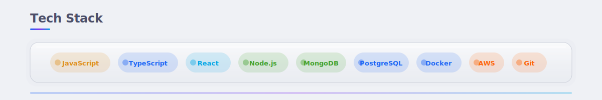
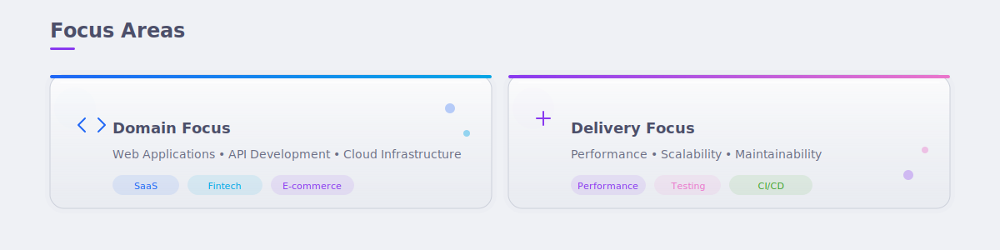

<!-- Premium Hero -->
<picture>
  <source media="(prefers-color-scheme: dark)" srcset="./assets/premium/premium-hero-dark.svg">
  
</picture>

<!-- Premium Contact Rail -->
<picture>
  <source media="(prefers-color-scheme: dark)" srcset="./assets/premium/premium-contact-dark.svg">
  
</picture>

---

<!-- Premium Stats Dashboard -->
<picture>
  <source media="(prefers-color-scheme: dark)" srcset="./assets/premium/premium-stats-dashboard-dark.svg">
  
</picture>

Data sourced from GitHub REST API & GraphQL • Auto-updated daily

---

<!-- Premium Tech Stack -->
### Tech Stack

<picture>
  <source media="(prefers-color-scheme: dark)" srcset="./assets/premium/premium-tech-stack-dark.svg">
  
</picture>

---

<!-- Premium Work Focus -->
### Focus Areas

<picture>
  <source media="(prefers-color-scheme: dark)" srcset="./assets/premium/premium-work-focus-dark.svg">
  
</picture>

---

<!-- Contribution Details - Collapsed -->

📊 Contribution Details

<!-- CONTRIBUTION-GRAPH:START -->

  <picture>
    <source media="(prefers-color-scheme: dark)" srcset="./assets/readme/contribution-heatmap-dark.svg">
    
  </picture>

<!-- CONTRIBUTION-GRAPH:END -->

---

⚡ Profile auto-generated with GitHub Actions
